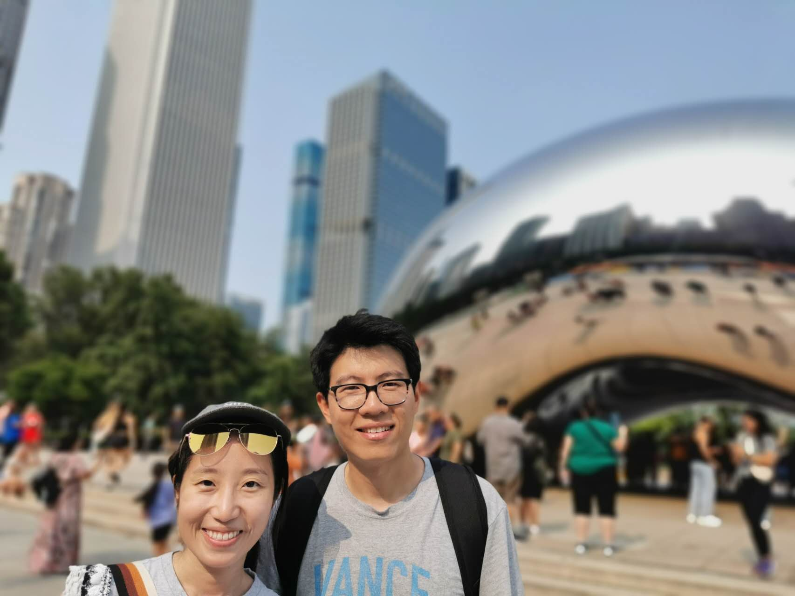
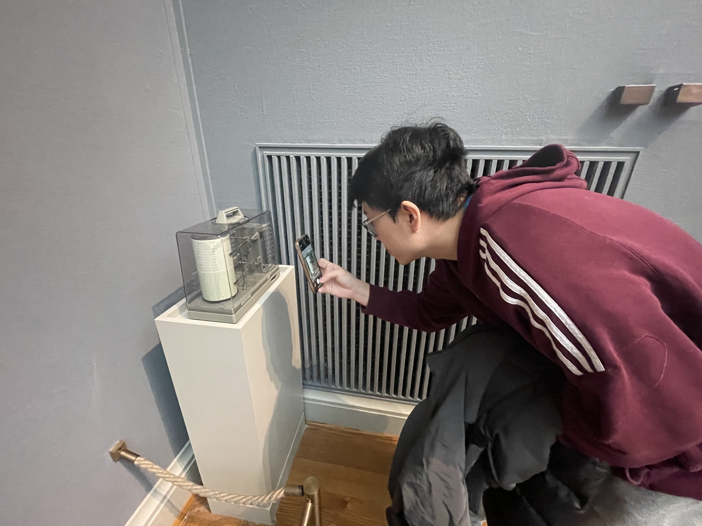
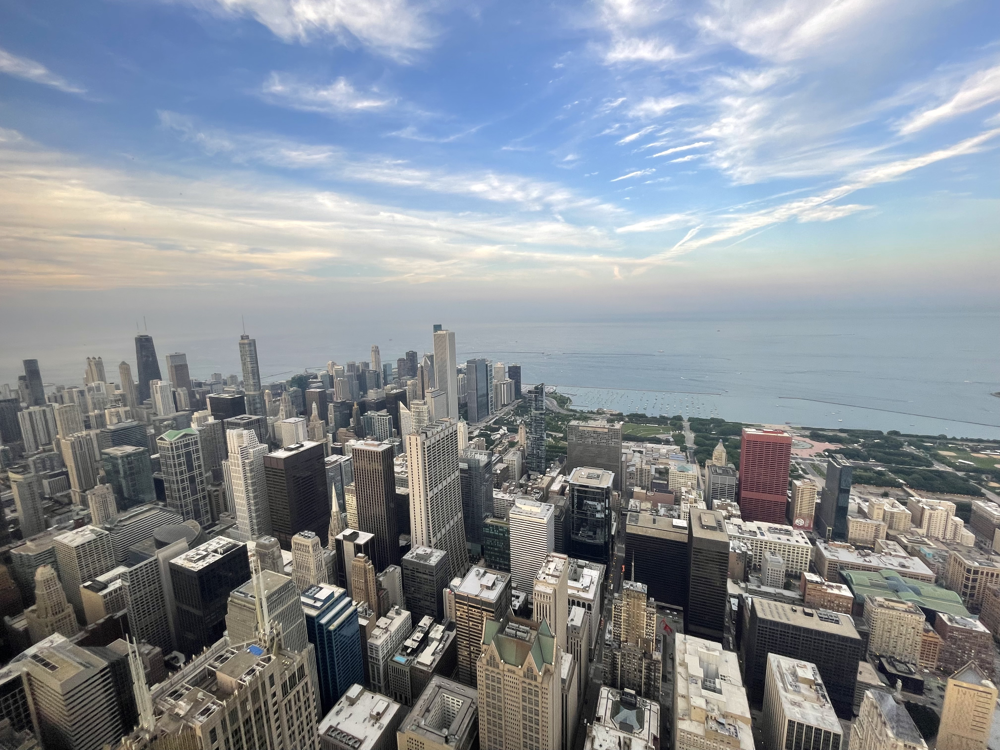
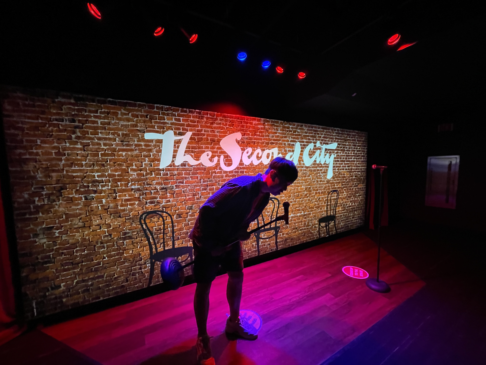
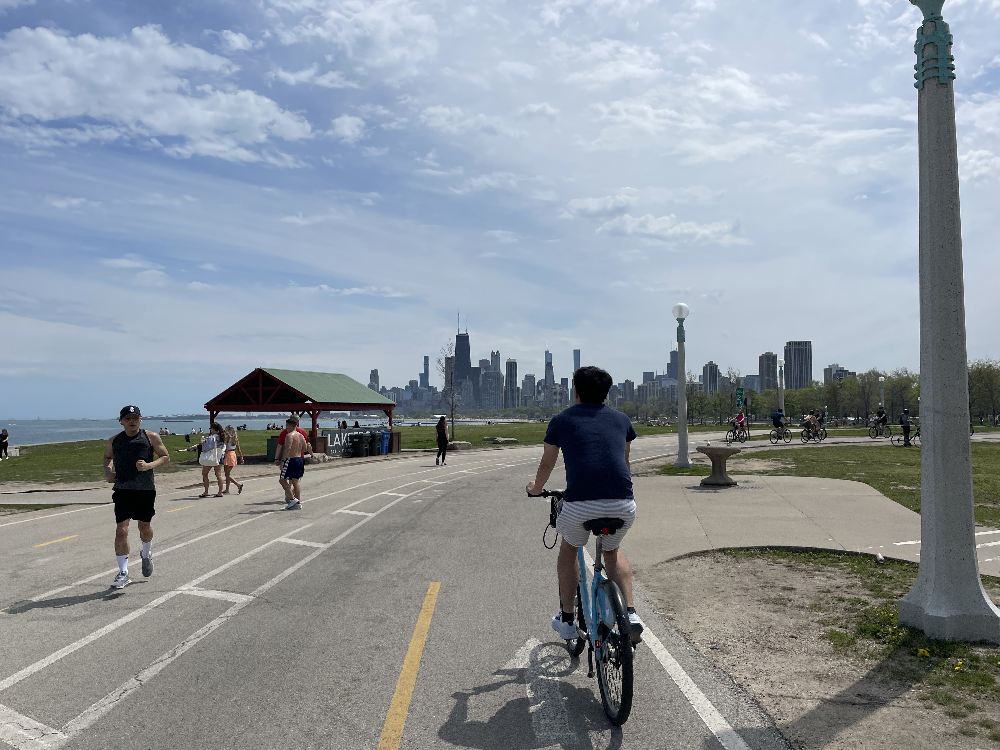
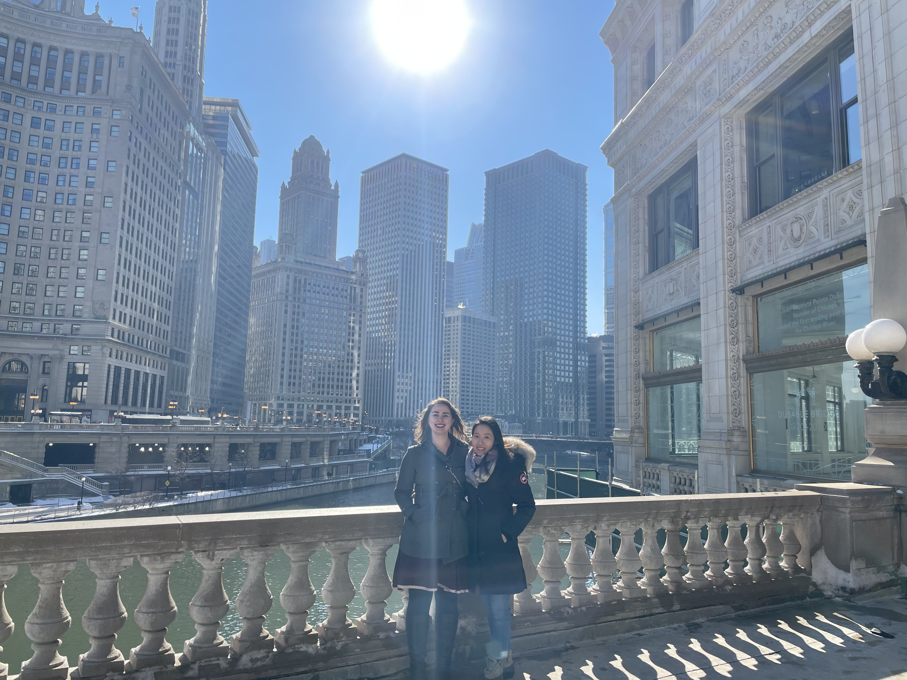
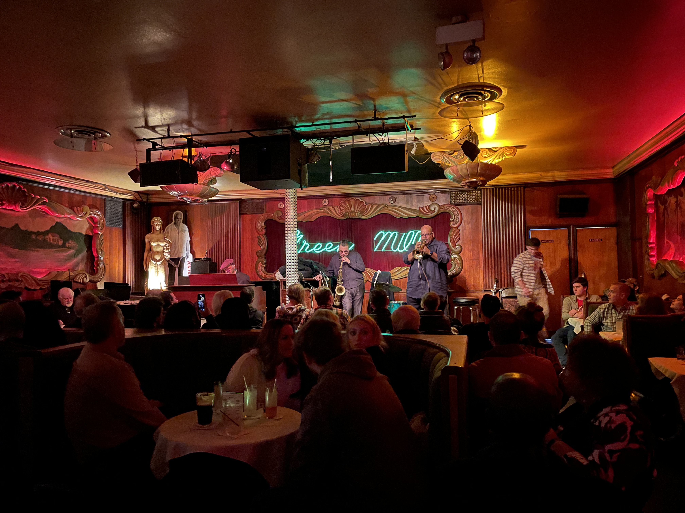

1. Millenium Park  
The iconic Cloud Gate (aka "the Bean"). It's been under construction for a while, but is now open to public again!
  

2. Art Institute of Chicago  
Walking distance from Millenium Park. We are no artists, but have always had a great time there. Bill's favorite "exhibit" is the mini-seismometer in various corners used to record ground motion, presumably for monitoring the well-being of the paintings.
  

3. Skydeck  
Located in the 103rd floor of Willis Tower, featuring "the Ledge", a glass balcony extending 4.3 feet outside of the building. Here is Abby's brother Greg on said ledge. Greg will be doing us the honor of officiating our wedding.
  

4. Second City  
Abby and Bill are big fans of "The Office", "Parks and Recreation", etc, and therefore always take friends who visit to an improv show. It has not disappointed. Here is a random photo we took.
  

5. Lakefront Trail  
It's a long-winding trail adjacent to Lake Michigan, good for walking, running, and biking. We've gone as far south as Hyde Park. Traveling northbound, you'll pass by some museums (including the Art Institute), the downtown area (aka "the Loop"), then some nice beaches.
  
   
6. Chicago Riverwalk  
A nice ~1.5 mile walk right through the heart of downtown Chicago. We like to get onto the riverwalk from the stairs at Franklin and Wacker and walk east until hitting the lake, where it merges into the Lakefront trail. Also shown in the picture our friend Erik took is the Architecture Tour. We cannot recommend this enough - a great way to learn about the history of the city and stories behind the buildings.
  

7. Diversey Driving Range  
If you're into golf and want to get in a few swings, this place is a great option! Come early or late in the day during the summer to avoid waits. Please follow the sign and "beware of flying golf balls"
 
<video height="300" controls>
  <source src="./photos/driving_range.MOV" type="video/quicktime">
  Your browser does not support the video tag.
</video>

9. Starbucks Reserve  
One of the biggest Starbucks stores, located on Michigan Avenue. Apart from a broader selection of drinks, you can also watch various brewing processes. Bill was unable to discern between the 20$ siphon-brewed coffee and his 3.86$ tall pike place. Maybe you can do better!
  

10. Music  
Like music? Abby has played classical piano since she was a kid, so we've gone to a few piano recitals at the Chicago Symphony Orchestra. The Green Mill (located in Uptown) has live jazz music and provides a more low-key environment than another locally-famous venue, Kingston Mines.
  

11. Lincoln Park Zoo  
A huge patch of green extending from North Ave (where 2nd City is) to Diversey Pkwy where we live. In our few years here, we'd often find ourselves walking through various parts in all seasons! We liked it so much we decided to host our wedding ceremony here.
  
