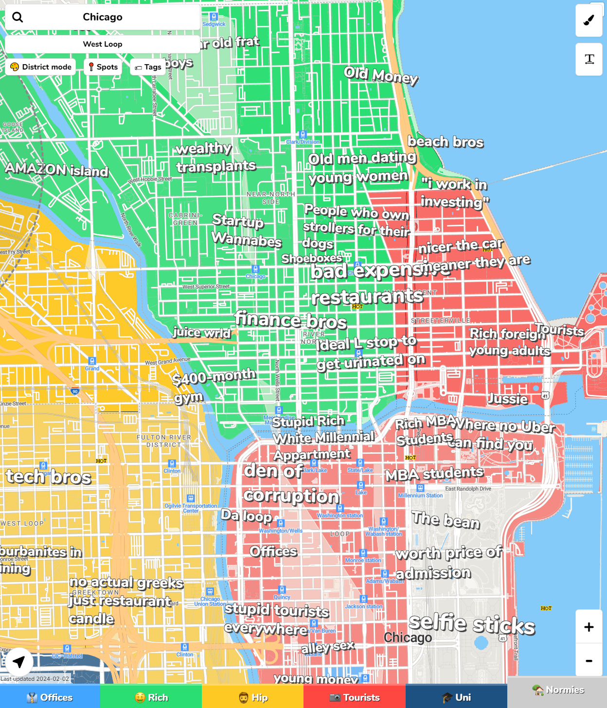

1. The [Westin](https://www.marriott.com/event-reservations/reservation-link.mi?id=1706111245071&key=GRP&app=resvlink) Michigan Avenue Chicago - 909 North Michigan Ave - 206 USD/night. Cut off date for the block rate is 2024/08/01

2. [Sofitel](https://book.passkey.com/e/50766758) Chicago Magnificent Mile - 20 E. Chestnut - 289 USD/night. Cut off date for the block rate is 2024/07/30

3. [Park Hyatt](https://www.hyatt.com/en-US/group-booking/CHIPH/G-CBW1) Chicago - 800 N Michigan Ave - 425 USD/night. Cut off date for the block rate is 2024/07/29

---

Airbnb is another option. For neighborhoods, we find River North, Gold Coast (where the 3 hotels are), Old Town, Lincoln Park, Lakeview East (where we live) all to be safe and close-ish to the main tourist attractions. 

For a second opinion:

>*[reddit source](https://www.reddit.com/r/chicago/comments/1874hcf/ok_who_made_his_hilarious_map_describing_chicagos/)*
