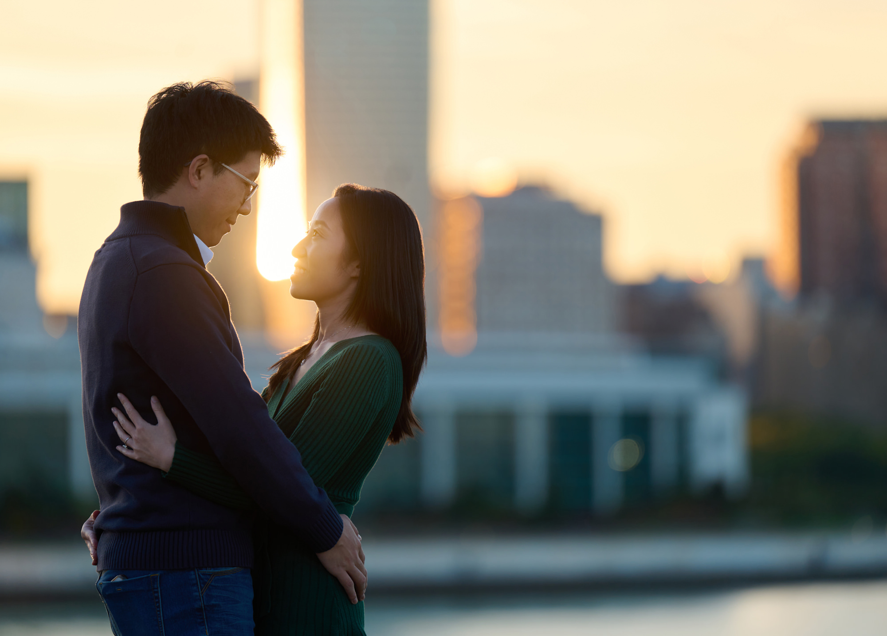

>*near Adler Planetarium, 2023 Nov*

Hello friends and family, 

We are delighted to announce that we are hosting our wedding ceremony and reception on August 31st, 2024 in Chicago, with a welcome party on the afternoon of August 30th. We would be honored by your presence.

We have secured block rates at a few [hotels](/hotel_block.md) if you're interested.  
**update on 8/4**: the deadline for these block rates have passed. If you still wish to book, please get in touch with us and we'll reach out to them.

We mailed our physical wedding invites on May 14th, which contains a QR code to RSVP. Here is the link to the [Google form](https://docs.google.com/forms/d/1qKb-qkMPHtPiIATk7a7MEcVVhMSMDfSrbLthg31Gu0Q/) just in case. TL;DR  
&nbsp; &nbsp; **8/30 Welcome Party**: Chicago River Cruise with Hors D'Oeuvres. Board at 455 N Cityfront Plaza Dr between 3:30-4:30pm, sailing is 4:30-6:00pm. 
&nbsp; &nbsp; **8/31 Wedding Ceremony, Reception**: Ceremoney starts at the Honeycomb 4:00pm, with cocktail and dinner at the North Pond 
We'll have a bus helping with transport on 8/31, more details about this when it's a week away.

For out-of-town guests who could use some ideas on what to do for the remainder of the long weekend, we wrote down some of our favorite [things to do](/fun.md) and [things to eat](/food.md) in Chicago. 

We truly consider your presence at our wedding as our present. That said, if you would like to express your warm wishes monetarily, we are going on our first trip together back to China in five years this November and could use your help getting plane tickets! Please email us so we can direct you to our personal Zelle account.
